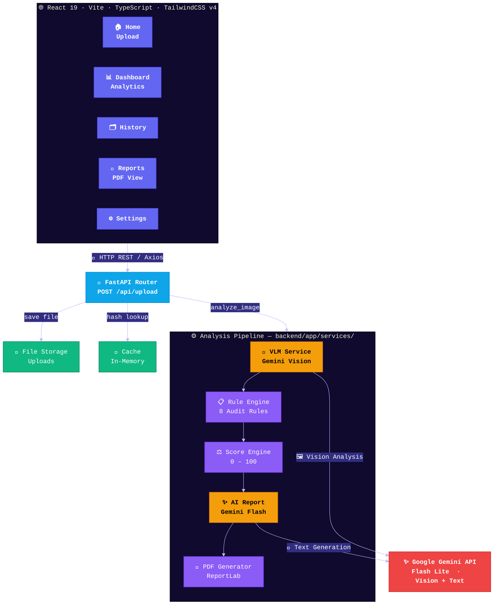
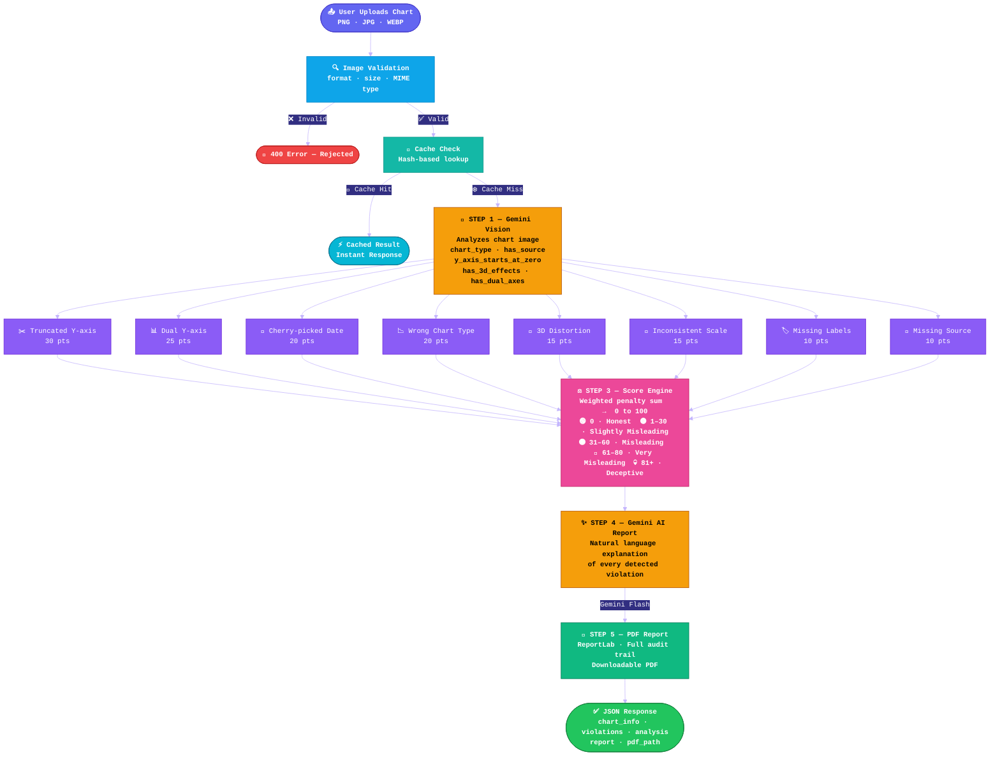

<div align="center">

<br/>

<!-- Animated Banner -->


<br/>

<p align="center">
  <strong>An intelligent, multi-layered system that exposes misleading data visualizations using<br/>Google Gemini Vision AI + a rule-based audit engine + LangChain explanation generation.</strong>
</p>

<br/>

<!-- Badges -->
<p align="center">
  
  
  
  
  
  
  
  
</p>

<br/>

<!-- Quick nav -->
<p align="center">
  <a href="#-overview">Overview</a> •
  <a href="#-features">Features</a> •
  <a href="#-architecture">Architecture</a> •
  <a href="#-flowchart">Flowchart</a> •
  <a href="#-violation-rules">Rules</a> •
  <a href="#-tech-stack">Stack</a> •
  <a href="#-getting-started">Setup</a> •
  <a href="#-api-reference">API</a> •
  <a href="#-project-structure">Structure</a>
</p>

<br/>

---

</div>

## 🌟 Overview

**ChartLie Detector** is a full-stack AI application that automatically detects **deceptive, misleading, or statistically dishonest data visualizations**. Upload any chart image and within seconds get:

- 🔍 A **structured audit** of 8 known chart deception patterns
- 📊 A **weighted lie score** (0–100) with severity classification
- 🤖 **AI-generated natural language explanations** via LangChain + Gemini
- 📄 A **downloadable PDF report** for sharing or citation
- 🗂️ **Full analysis history** with dashboard analytics

> **Why does this matter?**  
> Misleading charts are rampant in media, politics, and corporate reporting. A truncated Y-axis can make a 2% change look like a 200% change. This tool arms analysts, journalists, and everyday users with AI-powered fact-checking for visual data.

---

## ✨ Features

| Feature | Description |
|---|---|
| 🧠 **Gemini Vision AI** | Extracts structured chart metadata using Google's Gemini Flash Lite multimodal model |
| 📋 **8-Rule Audit Engine** | Checks for truncated axes, dual axes, 3D distortion, wrong chart types & more |
| ⚖️ **Weighted Lie Scoring** | Each violation carries a weighted penalty; produces a 0-100 deception score |
| 🤖 **LangChain Explanations** | Generates human-readable, context-aware explanations of each violation |
| 📄 **PDF Report Generator** | Full audit trail exported as a polished, printable PDF report |
| 📂 **Analysis History** | Persistent history of all past analyses with search and filter |
| 📊 **Interactive Dashboard** | Recharts-powered visualizations of your analysis activity |
| ⚡ **Result Caching** | Cache layer prevents redundant AI calls for identical images |
| 🐳 **Docker Ready** | Full `docker-compose.yml` for one-command deployment |
| 🔌 **REST API** | Clean FastAPI endpoints, fully documented via auto-generated Swagger UI |

---

## 🏗️ Architecture



---

## 🔄 Analysis Pipeline Flowchart



---

## 🛡️ Violation Rules

The rule engine checks **8 well-documented deception patterns**:

| # | Rule | Weight | Description |
|---|------|--------|-------------|
| 1 | **Truncated Y-axis** | 30 pts | Y-axis doesn't start at zero, exaggerating differences |
| 2 | **Dual Y-axis** | 25 pts | Two Y-axes create misleading correlations |
| 3 | **Cherry-picked Date Range** | 20 pts | Selective time windows hide broader trends |
| 4 | **Wrong Chart Type** | 20 pts | Inappropriate chart type distorts perception |
| 5 | **3D Distortion** | 15 pts | 3D effects alter perceived proportions |
| 6 | **Inconsistent Scale** | 15 pts | Non-uniform intervals mislead magnitude |
| 7 | **Missing Labels** | 10 pts | Absent axis labels or data point labels |
| 8 | **Missing Source** | 10 pts | No data source cited — unverifiable claims |

### 📊 Severity Scale

```
Score   0       Completely Honest     ████░░░░░░  0%
Score  1–30     Slightly Misleading   ████▓░░░░░  low
Score 31–60     Misleading            ████████░░  moderate
Score 61–80     Very Misleading       █████████░  high
Score  81+      Deceptive / Lying     ██████████  critical
```

---

## 🧰 Tech Stack

### Backend
| Technology | Version | Purpose |
|---|---|---|
| **Python** | 3.11+ | Core language |
| **FastAPI** | 0.139 | REST API framework |
| **Uvicorn** | 0.50 | ASGI web server |
| **Google GenAI SDK** | latest | Gemini Vision + LangChain |
| **Pydantic** | 2.x | Data validation & serialization |
| **Pillow** | 12.x | Image processing & validation |
| **python-multipart** | 0.0.32 | File upload handling |
| **python-dotenv** | 1.2 | Environment variable management |

### Frontend
| Technology | Version | Purpose |
|---|---|---|
| **React** | 19 | UI framework |
| **TypeScript** | 6.0 | Type safety |
| **Vite** | 8.1 | Build tool & dev server |
| **TailwindCSS** | 4.x | Utility-first styling |
| **Framer Motion** | 12.x | Animations |
| **TanStack Query** | 5.x | Server state management |
| **React Router** | 7.x | Client-side routing |
| **Recharts** | 3.x | Dashboard data visualization |
| **Lucide React** | latest | Icon library |
| **Axios** | 1.x | HTTP client |

---

## 🚀 Getting Started

### Prerequisites

- Python 3.11+
- Node.js 18+
- A [Google Gemini API Key](https://aistudio.google.com/app/apikey)

### 1. Clone the Repository

```bash
git clone https://github.com/your-username/ChartLie_Detector.git
cd ChartLie_Detector
```

### 2. Backend Setup

```bash
# Create and activate virtual environment
python -m venv venv

# Windows
venv\Scripts\activate
# macOS / Linux
source venv/bin/activate

# Install dependencies
pip install -r requirements.txt

# Configure environment
cp backend/.env.example backend/.env
# Edit backend/.env and set your GEMINI_API_KEY
```

```env
# backend/.env
GEMINI_API_KEY=your_google_gemini_api_key_here
```

```bash
# Start the backend
cd backend
uvicorn app.main:app --reload --host 0.0.0.0 --port 8000
```

The API will be live at: **http://localhost:8000**  
Swagger Docs: **http://localhost:8000/docs**

### 3. Frontend Setup

```bash
cd frontend

# Install dependencies
npm install

# Start dev server
npm run dev
```

The app will be live at: **http://localhost:5173**

### 4. Docker (One-Command Setup)

```bash
# From project root
docker-compose up --build
```

---

## 📡 API Reference

### `POST /api/upload`
Upload a chart image for analysis.

**Request:** `multipart/form-data`
| Field | Type | Description |
|---|---|---|
| `file` | `File` | Chart image (PNG, JPG, WEBP) |

**Response:** `200 OK`
```json
{
  "chart_info": {
    "chart_type": "bar",
    "has_source": false,
    "y_axis_starts_at_zero": false,
    "has_3d_effects": false,
    "has_dual_axes": false
  },
  "violations": [
    {
      "rule": "Truncated Y-axis",
      "severity": "high",
      "description": "Y-axis begins at 80 instead of 0..."
    }
  ],
  "analysis": {
    "score": 45,
    "severity": "Misleading",
    "total_violations": 2
  },
  "report": "This bar chart exhibits two significant deceptive patterns...",
  "pdf_report": "reports/analysis_20260714_120000.pdf"
}
```

**Error Responses:**

| Code | Meaning |
|---|---|
| `400` | Invalid file format or corrupted image |
| `422` | Validation error |
| `500` | Internal server error (Gemini API failure) |

---

## 📁 Project Structure

```
ChartLie_Detector/
├── 📄 README.md                    ← You are here
├── 📄 .gitignore                   ← Comprehensive ignore rules
├── 📄 docker-compose.yml           ← Docker orchestration
├── 📄 requirements.txt             ← Root Python deps
│
├── 🖥️  backend/
│   ├── 📄 .env                     ← Secrets (gitignored)
│   ├── 📄 requirements.txt
│   ├── 📄 download_misviz.py       ← Dataset downloader
│   ├── 📁 uploads/                 ← Uploaded chart images (gitignored)
│   ├── 📁 reports/                 ← Generated PDFs (gitignored)
│   ├── 📁 datasets/                ← Training data (gitignored)
│   ├── 📁 tests/                   ← Backend unit tests
│   └── 📁 app/
│       ├── 📄 main.py              ← FastAPI app entry point
│       ├── 📄 __init__.py
│       ├── 📁 api/
│       │   ├── 📄 router.py        ← Route aggregator
│       │   └── 📁 routes/
│       │       └── 📄 upload.py    ← Upload endpoint
│       ├── 📁 core/
│       │   ├── 📄 config.py        ← App configuration
│       │   └── 📄 logging.py       ← Logger setup
│       ├── 📁 services/
│       │   ├── 📄 analysis_service.py  ← Main pipeline orchestrator
│       │   ├── 📄 vlm_service.py       ← Gemini Vision integration
│       │   ├── 📄 gemini_service.py    ← Gemini client
│       │   ├── 📄 image_validator.py   ← Input validation
│       │   ├── 📄 report_service.py    ← PDF generation
│       │   └── 📄 cache_service.py     ← Result caching
│       ├── 📁 models/
│       │   └── 📄 chart_info.py    ← Pydantic ChartInfo schema
│       ├── 📁 rules/
│       │   ├── 📄 rule_engine.py       ← Rule orchestrator
│       │   ├── 📄 truncated_axis.py    ← Rule: Truncated Y-axis
│       │   ├── 📄 dual_axis.py         ← Rule: Dual Y-axis
│       │   ├── 📄 missing_baseline.py  ← Rule: Missing baseline
│       │   ├── 📄 missing_labels.py    ← Rule: Missing labels
│       │   ├── 📄 missing_source.py    ← Rule: Missing source
│       │   ├── 📄 inconsistent_scale.py← Rule: Inconsistent scale
│       │   ├── 📄 three_d.py           ← Rule: 3D distortion
│       │   └── 📄 wrong_chart_type.py  ← Rule: Wrong chart type
│       ├── 📁 scoring/
│       │   ├── 📄 score_engine.py  ← Violation → score calculator
│       │   └── 📄 weights.py       ← Rule weight configuration
│       ├── 📁 langchain/
│       │   ├── 📄 explanation_chain.py ← LangChain report chain
│       │   └── 📄 prompt_template.py   ← Prompt templates
│       ├── 📁 prompts/
│       │   └── 📄 vision_prompt.py ← Gemini Vision prompt
│       ├── 📁 output/              ← Temp AI outputs (gitignored)
│       └── 📁 utils/               ← Shared utilities
│
└── 🌐 frontend/
    ├── 📄 index.html               ← App entry HTML
    ├── 📄 package.json
    ├── 📄 vite.config.ts
    ├── 📄 tsconfig.json
    ├── 📁 public/                  ← Static assets
    └── 📁 src/
        ├── 📄 main.tsx             ← React entry point
        ├── 📄 App.tsx              ← Router + routes
        ├── 📄 App.css
        ├── 📄 index.css            ← Global styles + Tailwind
        ├── 📁 pages/
        │   ├── 📄 Home.tsx         ← Upload interface
        │   ├── 📄 Dashboard.tsx    ← Analytics overview
        │   ├── 📄 History.tsx      ← Past analyses
        │   ├── 📄 Reports.tsx      ← PDF report viewer
        │   ├── 📄 Settings.tsx     ← App settings
        │   └── 📄 NotFound.tsx     ← 404 page
        ├── 📁 components/
        │   ├── 📁 layout/          ← Navbar, Sidebar, Footer
        │   ├── 📁 upload/          ← Upload dropzone component
        │   ├── 📁 dashboard/       ← Dashboard widgets
        │   ├── 📁 history/         ← History table components
        │   ├── 📁 report/          ← Report display components
        │   ├── 📁 charts/          ← Recharts wrappers
        │   ├── 📁 common/          ← Shared UI components
        │   └── 📁 home/            ← Home page components
        ├── 📁 services/            ← Axios API calls
        ├── 📁 hooks/               ← Custom React hooks
        ├── 📁 types/               ← TypeScript type definitions
        └── 📁 utils/               ← Frontend utilities
```

---

## 🔬 How It Works — Deep Dive

### Step 1: Vision Language Model (VLM) Extraction
The uploaded chart image is sent to **Google Gemini Flash Lite** with a structured system prompt. The model returns a `ChartInfo` JSON object (validated by Pydantic) containing:
- Chart type (bar, line, pie, scatter, etc.)
- Whether the Y-axis starts at zero
- Presence of dual axes, 3D effects, labels, source citations
- Date range information, scale consistency

### Step 2: Rule-Based Audit
A deterministic rule engine runs **8 checks in sequence** against the extracted metadata. Each rule is a pure function that returns either `None` (no violation) or a violation dictionary `{ rule, severity, description, weight }`.

### Step 3: Weighted Scoring
Violations are aggregated: `score = min(100, sum(violation.weight for violation in violations))`. Severity bands classify the result into 5 categories.

### Step 4: AI Explanation Chain
A LangChain pipeline feeds the score, severity, and violation list into a Gemini prompt template that generates a polished, readable analysis report in natural language.

### Step 5: PDF Report
The full analysis — chart metadata, violations, score, and AI report — is compiled into a professionally formatted PDF using ReportLab and saved to disk.

---

## 🤝 Contributing

```bash
# Fork the repo, create a feature branch
git checkout -b feature/new-rule-cherry-picking

# Make your changes, run tests
cd backend && python -m pytest tests/

# Lint frontend
cd frontend && npm run lint

# Submit a Pull Request!
```

### Adding a New Rule
1. Create `backend/app/rules/your_rule.py`
2. Define `def check_your_rule(chart_info: Dict) -> Optional[Dict]`
3. Add it to `rule_engine.py`'s rules list
4. Add its weight to `scoring/weights.py`

---

## 📜 License

This project is licensed under the **MIT License** — see [LICENSE](./LICENSE) for details.

---

## 👤 Author

Built with 🤖 + ❤️ for data integrity and visual truth.

<div align="center">

<br/>

> *"The greatest deceptions are the ones that hide in plain sight — on a graph."*

<br/>

⭐ **Star this repo if you believe in honest data visualization!** ⭐

</div>
