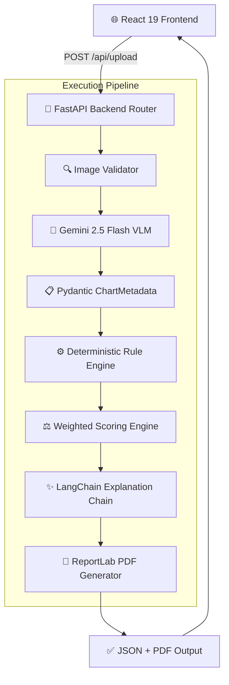
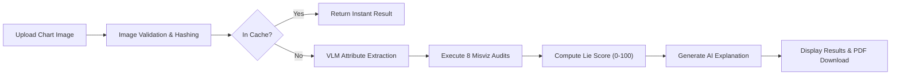
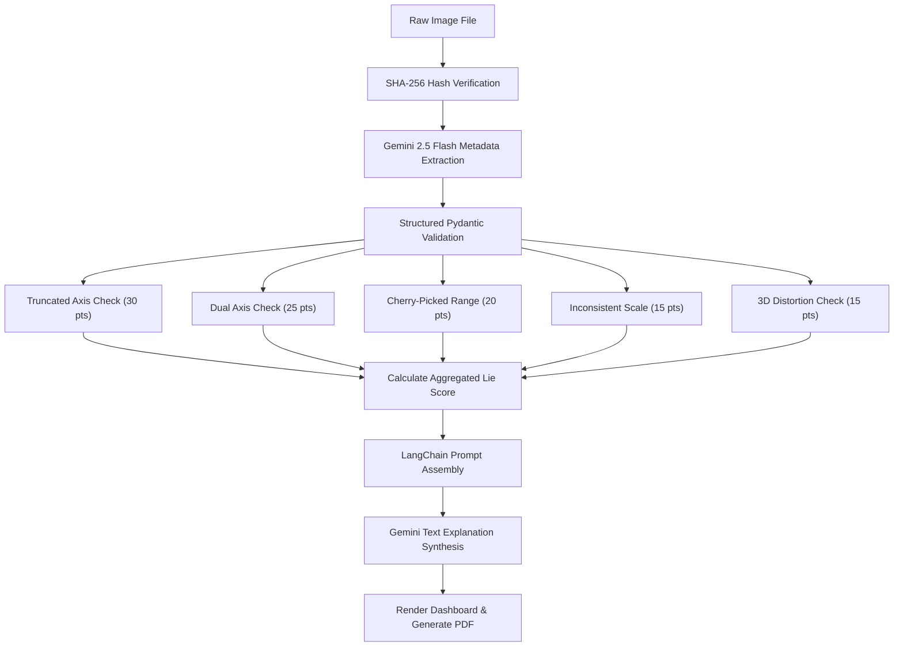
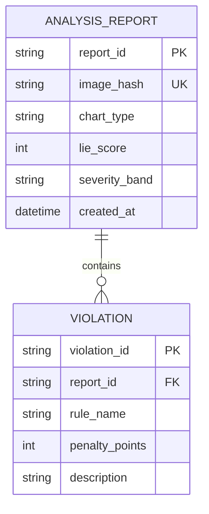
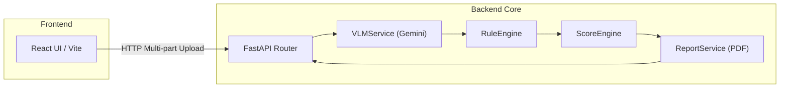

<div align="center">

# 📊 ChartLie Detector

> AI-powered platform for detecting misleading data visualizations using Vision-Language Models, deterministic rule auditing, and LangChain explanations.


</div>

---

## 📑 Table of Contents

- [Project Overview](#-project-overview)
- [Key Features](#-key-features)
- [Dataset](#-dataset)
- [Architecture](#-architecture)
- [Setup Guide](#-setup-guide)
- [API Documentation](#-api-documentation)
- [Future Improvements](#-future-improvements)
- [License](#-license)

---

## 📖 Project Overview

Misleading charts are widespread in media, corporate reporting, and marketing. Truncated axes, improper scales, dual axes, and 3D distortions frequently distort data, turning minor statistical variations into dramatic visual deceptions that misinform decision-makers.

**ChartLie Detector** solves this by combining Google Gemini 2.5 Flash Multimodal Vision AI with a deterministic rule engine grounded in the **ACL 2026 Misviz Benchmark**. The platform extracts chart metadata, audits images across 8 deception categories, assigns a weighted Lie Score (0–100), and generates human-readable AI explanations along with downloadable PDF reports.

---

## ✨ Key Features

- **Multimodal VLM Extraction** — Uses Google Gemini 2.5 Flash to automatically extract axis bounds, scale types, labels, and chart dimensions.
- **8-Category Deception Engine** — Audits charts against established Misviz rules including truncated Y-axes, dual axes, and inconsistent scaling.
- **Weighted Lie Scoring** — Calculates a deterministic 0–100 deception index categorized into 5 distinct severity bands.
- **LangChain Explanation Generator** — Converts visual violations into plain-English analytical breakdown reports.
- **Automated PDF Export** — Compiles structured audit logs, visual metadata, and AI reports into downloadable PDF documents using ReportLab.
- **In-Memory Result Caching** — Prevents redundant AI processing calls for identical image uploads via hash verification.
- **Interactive React Dashboard** — Dark-themed React 19 interface with real-time chart analysis, visual history, and metrics tracking.
- **Containerized Infrastructure** — Fully Dockerized microservices stack powered by Docker Compose.

---

## 📊 Dataset

### 7.1 Dataset Overview

ChartLie Detector leverages the **Misviz Benchmark dataset (ACL 2026)** curated by **Tonglet et al.** This dataset was chosen because it provides the first standardized, peer-reviewed collection of real-world and synthetic misleading visualizations categorized by specific structural manipulations.

### 7.2 Dataset Source

| Dataset | Purpose | Source |
|:---|:---|:---|
| Misviz Benchmark | Rule validation & deception pattern benchmarking | [GitHub / ACL 2026](https://github.com/misviz-benchmark) |

### 7.3 Dataset Structure

| Feature | Description |
|:---|:---|
| `image_id` | Unique identifier for chart visual sample |
| `chart_type` | Visual form (bar, line, pie, scatter, dual-axis) |
| `violation_type` | Deception category (truncated axis, inverted axis, missing baseline, etc.) |
| `ground_truth_metadata` | Hand-annotated axis bounds, zero-points, and tick labels |

### 7.4 Data Preprocessing

- Image validation and resolution standardization (PNG/JPG/WEBP)
- Image hashing via SHA-256 for response caching
- JSON schema normalization via Pydantic models prior to rule engine evaluation

### 7.5 Dataset Download

Run the provided helper script inside the backend directory to pull benchmark images:

```bash
python backend/download_misviz.py
```

---

## 🏗️ Architecture

### 8.1 System Architecture

ChartLie Detector operates as a decoupled microservices application. A React 19 frontend communicates over HTTP REST with a FastAPI backend service. The backend coordinates Gemini 2.5 Flash VLM analysis, passes structured JSON through a deterministic rule auditor, aggregates penalty scores, and uses LangChain to generate human-readable reports.


```mermaid
graph TD
    UI["🌐 React 19 Frontend"] -->|POST /api/upload| API["🔀 FastAPI Backend Router"]
    
    subgraph Execution Pipeline
        API --> VAL["🔍 Image Validator"]
        VAL --> VLM["🤖 Gemini 2.5 Flash VLM"]
        VLM --> META["📋 Pydantic ChartMetadata"]
        META --> RULE["⚙️ Deterministic Rule Engine"]
        RULE --> SCORE["⚖️ Weighted Scoring Engine"]
        SCORE --> AI["✨ LangChain Explanation Chain"]
        AI --> PDF["📄 ReportLab PDF Generator"]
    end
    
    PDF --> RES["✅ JSON + PDF Output"]
    RES --> UI
```

### 8.2 User Journey


```mermaid
flowchart LR
    A["Upload Chart Image"] --> B["Image Validation & Hashing"]
    B --> C{"In Cache?"}
    C -->|Yes| D["Return Instant Result"]
    C -->|No| E["VLM Attribute Extraction"]
    E --> F["Execute 8 Misviz Audits"]
    F --> G["Compute Lie Score (0-100)"]
    G --> H["Generate AI Explanation"]
    H --> I["Display Results & PDF Download"]
```

### 8.3 Pipeline Flow


```mermaid
flowchart TD
    A["Raw Image File"] --> B["SHA-256 Hash Verification"]
    B --> C["Gemini 2.5 Flash Metadata Extraction"]
    C --> D["Structured Pydantic Validation"]
    D --> E1["Truncated Axis Check (30 pts)"]
    D --> E2["Dual Axis Check (25 pts)"]
    D --> E3["Cherry-Picked Range (20 pts)"]
    D --> E4["Inconsistent Scale (15 pts)"]
    D --> E5["3D Distortion Check (15 pts)"]
    E1 & E2 & E3 & E4 & E5 --> F["Calculate Aggregated Lie Score"]
    F --> G["LangChain Prompt Assembly"]
    G --> H["Gemini Text Explanation Synthesis"]
    H --> I["Render Dashboard & Generate PDF"]
```

### 8.4 ER Diagram


```mermaid
erDiagram
    ANALYSIS_REPORT {
        string report_id PK
        string image_hash UK
        string chart_type
        int lie_score
        string severity_band
        datetime created_at
    }

    VIOLATION {
        string violation_id PK
        string report_id FK
        string rule_name
        int penalty_points
        string description
    }

    ANALYSIS_REPORT ||--o{ VIOLATION : "contains"
```

### 8.5 Component Interaction


```mermaid
graph LR
    subgraph Frontend
        FE["React UI / Vite"]
    end
    
    subgraph Backend Core
        ROUTER["FastAPI Router"]
        VLM_SVC["VLMService (Gemini)"]
        ENG_SVC["RuleEngine"]
        SCORE_SVC["ScoreEngine"]
        REPORT_SVC["ReportService (PDF)"]
    end

    FE -->|HTTP Multi-part Upload| ROUTER
    ROUTER --> VLM_SVC
    VLM_SVC --> ENG_SVC
    ENG_SVC --> SCORE_SVC
    SCORE_SVC --> REPORT_SVC
    REPORT_SVC --> ROUTER
```

---

## ⚙️ Setup Guide

### 9.1 Prerequisites

| Software | Version | Required |
|:---|:---|:---|
| Python | 3.11+ | ✅ |
| Node.js | 18.0+ | ✅ |
| Docker | 20.10+ | Optional |
| Gemini API Key | Google AI Studio | ✅ |

### 9.2 Project Structure

```text
ChartLie_Detector/
├── backend/
│   ├── app/
│   │   ├── api/          # FastAPI route handlers
│   │   ├── core/         # Logger and app settings
│   │   ├── langchain/    # Explanation generation chains
│   │   ├── models/       # Pydantic schemas
│   │   ├── rules/        # 8 Misviz rule check implementations
│   │   ├── scoring/      # Lie score calculations & weights
│   │   └── services/     # VLM, PDF, and analysis orchestrators
│   ├── download_misviz.py# Benchmark dataset download utility
│   ├── main.py           # Application entrypoint
│   └── requirements.txt  # Python backend dependencies
├── frontend/
│   ├── src/
│   │   ├── components/   # UI layout, dropzone, and chart components
│   │   ├── pages/        # Dashboard, Home, History, and Reports
│   │   ├── services/     # Axios API service handlers
│   │   └── types/        # TypeScript declarations
│   ├── package.json      # Node.js dependencies
│   └── vite.config.ts    # Vite bundler config
├── docker-compose.yml    # Multi-container deployment specification
└── Dockerfile            # Container build instructions
```

### 9.3 Environment Variables

| Variable | Description | Required |
|:---|:---|:---|
| `GEMINI_API_KEY` | Google Gemini API key for VLM and text generation | ✅ |
| `BACKEND_URL` | Endpoint URL for API communication (`http://localhost:8000`) | Optional |

### 9.4 Installation Guide

#### Backend Setup

```bash
cd backend
python -m venv venv
# Linux/macOS: source venv/bin/activate
# Windows: venv\Scripts\activate
pip install -r requirements.txt
cp .env.example .env  # Add GEMINI_API_KEY to .env
uvicorn app.main:app --reload --port 8000
```

#### Frontend Setup

```bash
cd frontend
npm install
npm run dev
```

### 9.5 Five-Minute Quick Start

1. Clone the repository: `git clone https://github.com/your-username/ChartLie_Detector.git`
2. Open terminal in project root and launch via Docker Compose:
   ```bash
   docker-compose up --build
   ```
3. Open `http://localhost:5173` in your browser.
4. Upload any chart image (PNG/JPG/WEBP).
5. Review detected violations, Lie Score, AI explanation, and export PDF!

---

## 📡 API Documentation

### 10.1 Authentication

The current standalone version operates without user login. API requests require a valid backend configuration with `GEMINI_API_KEY` configured in `.env`.

### 10.2 API Endpoints

| Method | Endpoint | Description |
|:---|:---|:---|
| `POST` | `/api/upload` | Upload chart image for analysis, scoring, and report generation |
| `GET` | `/api/history` | Retrieve log of previously analyzed visualization reports |
| `GET` | `/docs` | Interactive Swagger API documentation |

### 10.3 Error Responses

| Code | Meaning |
|:---|:---|
| `200` | Analysis complete |
| `400` | Unsupported file format or unreadable image file |
| `422` | Request payload validation failure |
| `500` | VLM API communication error |

### 10.4 Usage Guide

Example analysis request via cURL:

```bash
curl -X POST "http://localhost:8000/api/upload" \
  -H "accept: application/json" \
  -H "Content-Type: multipart/form-data" \
  -F "file=@sample_chart.png"
```

Example JSON response snippet:

```json
{
  "chart_info": {
    "chart_type": "bar",
    "y_axis_starts_at_zero": false
  },
  "violations": [
    {
      "rule": "Truncated Y-axis",
      "severity": "high",
      "weight": 30
    }
  ],
  "analysis": {
    "score": 30,
    "severity": "Misleading"
  }
}
```

### 10.5 Deployment Guide

Deploy using Docker Compose for containerized production:

```bash
docker-compose up -d --build
```

Configured ports:
- Frontend: `http://localhost:5173` (or port `7860` on Hugging Face Spaces)
- Backend: `http://localhost:8000`

---

## 🚀 Future Improvements

- **Interactive Box Cropping** — Allow users to crop specific sub-charts in multi-panel figures
- **OCR Text Correction Engine** — Cross-reference blurry axis text with chart data points
- **Browser Extension** — Fact-check web charts directly while browsing news websites
- **Batch Processing API** — Enable enterprise bulk audit uploads for research teams
- **Custom Rule Builder** — Allow organizations to define custom compliance style guides
- **Fine-Tuned Vision Models** — Train open-weight LLaVA/Qwen-VL models specifically on Misviz
- **Multi-Language Explanations** — Produce report outputs in Spanish, French, German, and Hindi
- **Automated Chart Reconstruction** — Generate a corrected version of the misleading chart automatically

---

## 📄 License

This project is licensed under the **MIT License** — see the [LICENSE](LICENSE) file for details.

---

<div align="center">

**Built with ❤️ for visual data integrity and truth in analytics**

</div>
