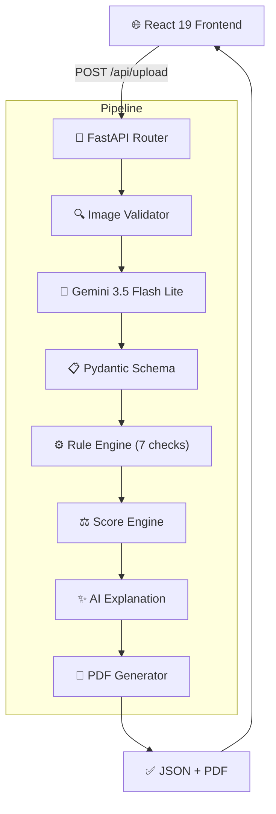
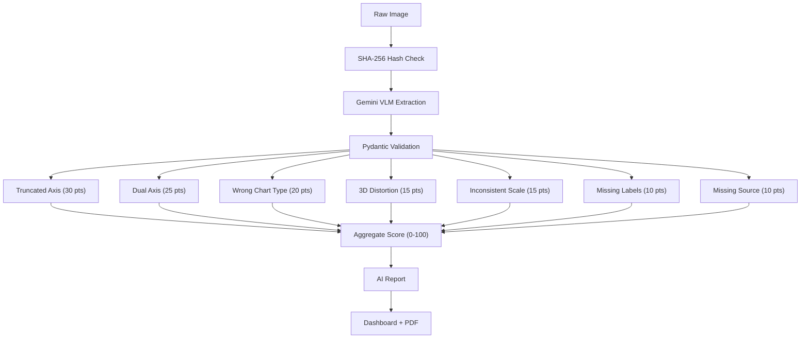

<div align="center">

# 📊 ChartLie Detector

> AI-powered platform for detecting misleading data visualizations using Vision-Language Models, deterministic rule auditing, and LangChain explanations.


[Live Demo](https://huggingface.co/spaces/YOUR_USERNAME/ChartLie-Detector) · [Report Bug](https://github.com/mansi-wagh/ChartLie_Detector-AI/issues) · [Request Feature](https://github.com/mansi-wagh/ChartLie_Detector-AI/issues)

</div>

---

## 🖼️ Screenshots

<!-- Add your screenshots here. Replace the placeholder text with actual image paths. -->
<!-- Example:  -->

| Upload & Analyze | Audit Results | PDF Report |
|:---:|:---:|:---:|
| *Add screenshot* | *Add screenshot* | *Add screenshot* |

| Settings Page | History Page |
|:---:|:---:|
| *Add screenshot* | *Add screenshot* |

---

## 📑 Table of Contents

- [Project Overview](#-project-overview)
- [Key Features](#-key-features)
- [Dataset](#-dataset)
- [Architecture](#-architecture)
- [Setup Guide](#-setup-guide)
- [API Documentation](#-api-documentation)
- [Deployment](#-deployment)
- [Future Improvements](#-future-improvements)
- [License](#-license)

---

## 📖 Project Overview

Misleading charts are widespread in media, corporate reporting, and marketing. Truncated axes, improper scales, dual axes, and 3D distortions frequently distort data, turning minor statistical variations into dramatic visual deceptions that misinform decision-makers.

**ChartLie Detector** solves this by combining Google Gemini 3.5 Flash Lite Multimodal Vision AI with a deterministic rule engine grounded in the **ACL 2026 Misviz Benchmark**. The platform extracts chart metadata, audits images across 7 deception categories, assigns a weighted Lie Score (0–100), and generates human-readable AI explanations along with downloadable PDF reports.

---

## ✨ Key Features

| Feature | Description |
|:---|:---|
| 🤖 **Multimodal VLM Extraction** | Uses Gemini 3.5 Flash Lite to extract axis bounds, scale types, labels, and chart dimensions from images |
| ⚙️ **7-Category Deception Engine** | Audits charts for truncated Y-axes, dual axes, 3D distortion, inconsistent scaling, missing labels/source, and wrong chart types |
| ⚖️ **Weighted Lie Scoring** | Deterministic 0–100 deception index: HONEST → SUSPICIOUS → MISLEADING → DECEPTIVE |
| 📝 **Concise AI Reports** | Converts violations into actionable summaries (What's Wrong → Why It Matters → How to Fix) |
| 📄 **PDF Export** | Professional PDF reports with tables, violations breakdown, and AI analysis |
| 🔑 **Bring Your Own API Key** | Users can add their Gemini API key in Settings — no setup friction |
| 🧠 **Smart Caching** | SHA-256 hash-based caching prevents redundant API calls for identical images |
| 🌙 **Modern React Dashboard** | Dark-themed React 19 UI with real-time analysis, history, and export |
| 🐳 **One-Click Deploy** | Fully Dockerized for Hugging Face Spaces |

---

## 📊 Dataset

ChartLie Detector leverages the **Misviz Benchmark dataset (ACL 2026)** curated by **Tonglet et al.** — the first standardized, peer-reviewed collection of real-world and synthetic misleading visualizations.

| Feature | Description |
|:---|:---|
| `chart_type` | Visual form (bar, line, pie, scatter, dual-axis) |
| `misleader` | Deception categories (truncated axis, inverted axis, 3D, misrepresentation, dual axis) |
| `bbox` | Bounding box annotations for deceptive regions |

**Preprocessing:** Image validation (PNG/JPG/WEBP, max 10MB), SHA-256 hashing for caching, Pydantic schema normalization.

---

## 🏗️ Architecture

### System Architecture


```mermaid
graph TD
    UI["🌐 React 19 Frontend"] -->|POST /api/upload| API["🔀 FastAPI Router"]
    
    subgraph Pipeline
        API --> VAL["🔍 Image Validator"]
        VAL --> VLM["🤖 Gemini 3.5 Flash Lite"]
        VLM --> META["📋 Pydantic Schema"]
        META --> RULE["⚙️ Rule Engine (7 checks)"]
        RULE --> SCORE["⚖️ Score Engine"]
        SCORE --> AI["✨ AI Explanation"]
        AI --> PDF["📄 PDF Generator"]
    end
    
    PDF --> RES["✅ JSON + PDF"]
    RES --> UI
```

### Pipeline Flow


```mermaid
flowchart TD
    A["Raw Image"] --> B["SHA-256 Hash Check"]
    B --> C["Gemini VLM Extraction"]
    C --> D["Pydantic Validation"]
    D --> E1["Truncated Axis (30 pts)"]
    D --> E2["Dual Axis (25 pts)"]
    D --> E3["Wrong Chart Type (20 pts)"]
    D --> E4["3D Distortion (15 pts)"]
    D --> E5["Inconsistent Scale (15 pts)"]
    D --> E6["Missing Labels (10 pts)"]
    D --> E7["Missing Source (10 pts)"]
    E1 & E2 & E3 & E4 & E5 & E6 & E7 --> F["Aggregate Score (0-100)"]
    F --> G["AI Report"]
    G --> H["Dashboard + PDF"]
```

### Severity Bands

| Score | Rating | Meaning |
|:---|:---|:---|
| 0–20 | 🟢 HONEST | Chart follows best practices |
| 21–50 | 🟡 SUSPICIOUS | Minor irregularities present |
| 51–75 | 🟠 MISLEADING | Visual choices alter interpretation |
| 76–100 | 🔴 DECEPTIVE | Significant manipulation detected |

---

## ⚙️ Setup Guide

### Prerequisites

| Software | Version | Required |
|:---|:---|:---|
| Python | 3.11+ | ✅ |
| Node.js | 18.0+ | ✅ |
| Docker | 20.10+ | Optional |
| Gemini API Key | [Get free key](https://aistudio.google.com/apikey) | ✅ |

### Project Structure

```text
ChartLie_Detector/
├── backend/
│   ├── app/
│   │   ├── api/          # FastAPI route handlers
│   │   ├── core/         # Config, logger, Gemini client
│   │   ├── langchain/    # AI explanation generation
│   │   ├── models/       # Pydantic schemas
│   │   ├── prompts/      # VLM vision prompts
│   │   ├── rules/        # 7 deception rule checks
│   │   ├── scoring/      # Score calculations & weights
│   │   ├── services/     # VLM, PDF, analysis orchestrators
│   │   └── utils/        # Image hashing utilities
│   └── requirements.txt
├── frontend/
│   ├── src/
│   │   ├── components/   # UI layout, charts, upload
│   │   ├── pages/        # Dashboard, Home, History, Settings, Reports
│   │   ├── services/     # Axios API service
│   │   └── types/        # TypeScript declarations
│   └── package.json
├── Dockerfile            # Multi-stage build (HF Spaces ready)
└── docker-compose.yml    # Local multi-container setup
```

### Quick Start

**Backend:**
```bash
cd backend
python -m venv venv
.\venv\Scripts\Activate        # Windows
# source venv/bin/activate     # macOS/Linux
pip install -r requirements.txt
# Add GEMINI_API_KEY to backend/.env
uvicorn app.main:app --reload --port 8000
```

**Frontend:**
```bash
cd frontend
npm install
npm run dev
```

Open **http://localhost:5173** → Upload a chart → View results!

---

## 📡 API Documentation

### Endpoints

| Method | Endpoint | Description |
|:---|:---|:---|
| `POST` | `/api/upload` | Upload chart image for full analysis |
| `GET` | `/health` | Health check |
| `GET` | `/docs` | Interactive Swagger docs |

### Optional Headers

| Header | Description |
|:---|:---|
| `X-Gemini-Key` | User's own Gemini API key (overrides server default) |

### Example

```bash
curl -X POST "http://localhost:8000/api/upload" \
  -H "Content-Type: multipart/form-data" \
  -H "X-Gemini-Key: YOUR_KEY" \
  -F "file=@chart.png"
```

```json
{
  "status": "success",
  "chart_info": { "chart_type": "bar", "y_axis_start": 50 },
  "violations": [
    { "rule": "Truncated Y-axis", "severity": "High", "weight": 30 }
  ],
  "analysis": { "score": 75, "severity": "MISLEADING" },
  "pdf_url": "/api/reports/chart.pdf"
}
```

---

## 🚀 Deployment

### Hugging Face Spaces (Recommended — Free)

1. Create a Space at [huggingface.co/new-space](https://huggingface.co/new-space) → SDK: **Docker**, Hardware: **CPU basic**
2. Add secrets in Space Settings:
   - `GEMINI_API_KEY` = your key
   - `GEMINI_MODEL` = `gemini-3.5-flash-lite`
3. Push:
   ```bash
   git remote add hf https://huggingface.co/spaces/YOUR_USERNAME/ChartLie-Detector
   git push hf main
   ```
4. Wait 3–5 min → App is live! 🎉

### Docker (Local)

```bash
docker-compose up --build
# App: http://localhost:80 | API: http://localhost:8000
```

---

## 🔮 Future Improvements

- **Interactive Box Cropping** — Crop sub-charts in multi-panel figures
- **Browser Extension** — Fact-check charts while browsing news
- **Batch Processing API** — Bulk audit uploads for research teams
- **Fine-Tuned Vision Models** — Train open-weight models on Misviz data
- **Automated Chart Reconstruction** — Generate corrected versions of misleading charts

---

## 📄 License

This project is licensed under the **MIT License** — see the [LICENSE](LICENSE) file for details.

---

<div align="center">

**Built with ❤️ for visual data integrity and truth in analytics**

</div>
